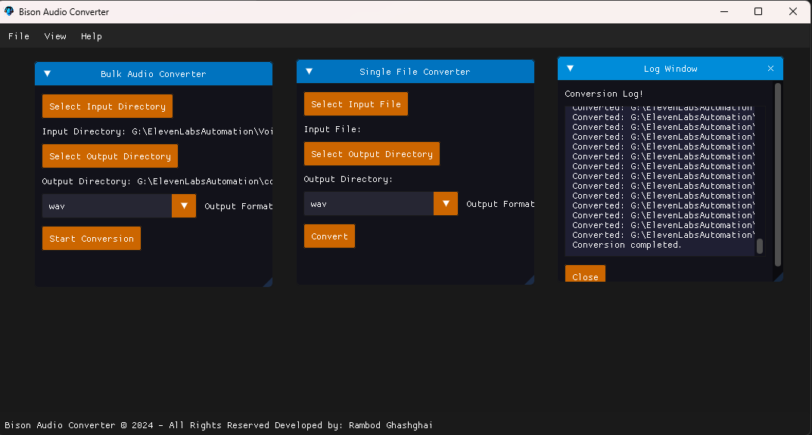

# 🎧 Bison Audio Converter


**Bison Audio Converter** is a powerful cross-platform audio file conversion tool written in **C++** with a user-friendly **ImGui**-based GUI. This tool is designed for bulk and batch audio conversion, preserving complex directory structures and making it ideal for large-scale audio processing tasks.

🔗 **Website**: [rambod.net](https://rambod.net)

---

## 🌟 Features

### 🔄 **Bulk and Batch Audio Conversion**
- Convert entire directories and subdirectories of audio files while preserving the folder structure.
- Process thousands or even millions of audio files seamlessly.

### 🎨 **ImGui-based GUI**
- Lightweight, responsive interface with real-time feedback.
- Designed for ease of use and efficiency.

### 🛠️ **Supported Formats**
- **Input**: WAV
- **Output**: MP3

### 🚀 **Cross-Platform**
- Available for **Windows** and **Linux**.

### 📜 **Conversion Logging**
- Real-time logs for debugging and workflow monitoring.

---

## 🖥️ Screenshots

### Bulk Conversion Interface



### Conversion Progress


---

## 🛠️ Build Instructions

### Prerequisites

Ensure the following tools are installed:

- **CMake** (3.16 or higher)
- **LLVM/Clang** (or your preferred compiler)
- **vcpkg** for managing dependencies

Install the required libraries with ```vcpkg```:

```bash
vcpkg install imgui['sfml-binding'] sfml libvorbis mp3lame fmt
```

### 🚧 Building the Project

1. **Clone the repository**:
   ```bash
   git clone https://github.com/rambod/BisonAudioConverter.git
   cd BisonAudioConverter
   ```

2. **Set up the build directory and generate files**:
   ```bash
   cmake -S . -B cmake-build-debug -DCMAKE_TOOLCHAIN_FILE=C:/vcpkg/scripts/buildsystems/vcpkg.cmake
   ```

3. **Build the project**:
   ```bash
   cmake --build cmake-build-debug
   ```

4. **Run the executable**:
   ```bash
   ./cmake-build-debug/BisonAudioConverter
   ```

---

## 🚀 Usage

### Bulk Audio Conversion 🗂️

1. **Select Input Directory**: Choose the folder containing your audio files.
2. **Select Output Directory**: Choose where you want the converted files to be saved.
3. **Start Conversion**: Click **```Start Conversion```** and watch the progress!

### Single File Conversion 🎵

1. **Select Input File**: Pick a single audio file for conversion.
2. **Select Output Directory**: Choose the output location.
3. **Convert**: Click **```Convert```** to process the file.

### Log Window 📜

- View real-time logs to track the conversion process and diagnose issues.

---

## 🖼️ Directory Structure

```
BisonAudioConverter/
│-- CMakeLists.txt
│-- resources/
│   ├── icon.png
│   └── ...
│-- screenshots/
│   ├── Screenshot_2024-12-11_204410.png
│   └── Screenshot_2024-12-11_204405.png
│-- src/
│   ├── main.cpp
│   ├── AudioConverter.cpp
│   └── MainWindow.cpp
└── README.md
```

---

## 🤝 Contributing

Contributions are welcome! Please follow these steps:

1. **Fork the repository**.
2. **Create a feature branch**:
   ```bash
   git checkout -b feature-name
   ```
3. **Commit your changes**:
   ```bash
   git commit -m 'Description of changes'
   ```
4. **Submit a pull request**.

---

## 📜 License

This project is licensed under the **MIT License**.

---

## 🙌 Credits

- **ImGui**: For the GUI.
- **SFML**, **libvorbis**, **lame**, **fmt**: For handling audio and utilities.
- **Rambod Ghashghai**: Developer.

🔗 Visit [rambod.net](https://rambod.net) for more information and updates.
